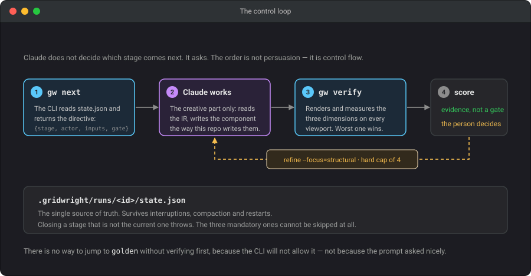
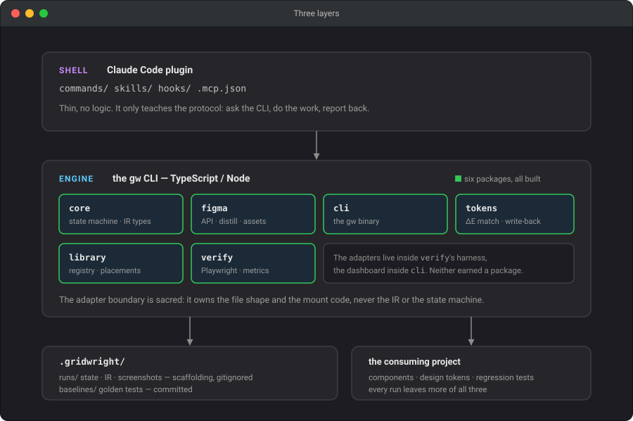
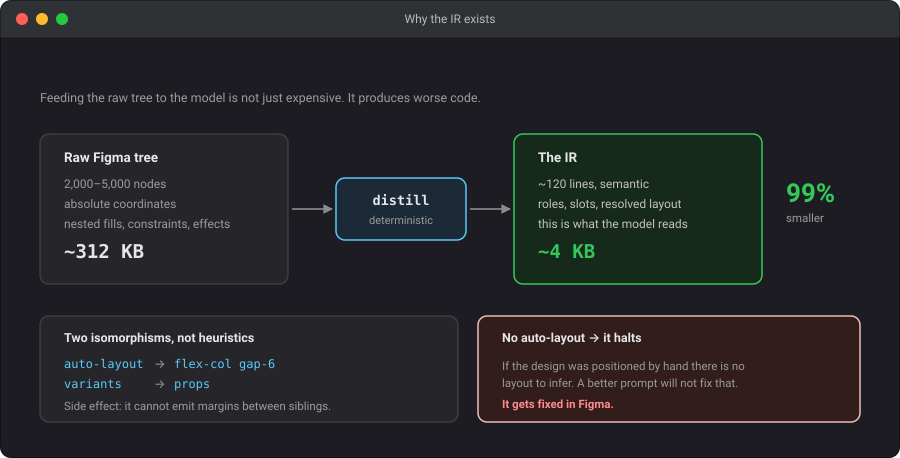
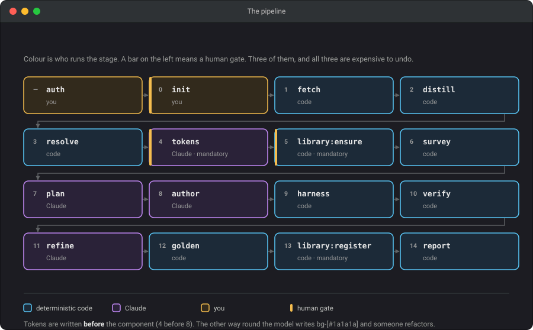

# Gridwright

End-to-end layout pipeline. A Figma node goes in; a built, visually verified
component registered in the project's design system comes out. Driven from
Claude Code.

[](LICENSE)


> **The design comes in as a node and leaves as a system.**
>
> Gridwright does not generate components: it builds the project's design system
> one node at a time. Every run leaves the repo with more resolved tokens, more
> registered components and more verified surface. If a component turns out fine
> but contributed nothing to the system, the run failed.

**Status: all five phases built, and the component path run end to end on a
real project.** A Figma node goes in; a component comes out registered in the
library, with its design and its render frozen side by side and a score at the
width the frame was drawn at — 90% on the one it has built so far.

What that does not mean is finished. View mode has been built but barely run,
and nothing here has shipped to production yet. See
[known gaps](#known-gaps).

---

## The idea

The obvious temptation is to write a long prompt explaining to an agent how to
build a layout. That has been tried: an earlier repo has a five-phase workflow
written in prose, and the agent skips the analysis phase every time the request
looks simple. **A prompt is a suggestion.**

Gridwright inverts the split. The state machine lives on disk and a CLI enforces
it. Claude does not decide which stage comes next: it asks.



```console
$ gw next --json
{
  "run": "hero-about-us-01",
  "stage": "author",
  "actor": "agent",
  "action": "write the component",
  "inputs": { "ir": "…/ir.json", "reference": "…/reference.png" },
  "gate": null
}
```

The split of labour is explicit:

| Code does this | The model does this |
|---|---|
| Pull the node, the assets and the reference | Write the component idiomatically for this repo |
| Distill the tree into the IR | Name things, decide the prop API |
| Match and classify tokens | Name the new tokens |
| Index existing components | Decide what to reuse |
| Render, measure, diff | Read the diff and fix it |

If it can be checked with an assert, the model does not do it. If it needs
judgment about code that already exists, the program does not do it.

---

## Architecture

Three layers. The Claude Code plugin is a thin shell that only teaches the
protocol; all the logic lives in the `gw` binary; the outputs land in the
consuming project.



```
packages/
├── core/     IR types, state machine, scoring, config, credentials
├── figma/    API client, distill, asset and vector extraction
├── tokens/   read the project's tokens, classify, write back
├── library/  registry, barrel, survey, placements, conventions
├── verify/   ephemeral harness, Playwright, perceptual diff
└── cli/      the gw binary, and the dashboard it generates
```

Six, not the eight the first spec drew. The adapters ended up inside `verify`'s
harness and the dashboard inside `cli`, and neither earned a package of its own.

**Stack**: TypeScript, Node, pnpm workspaces. Vitest for the core, Playwright
for verify, `sharp` for assets, `odiff` for the perceptual diff, `ts-morph` and
`postcss` for the token write-back.

---

## Install

There are two ways in, and the recommended one is not the one you type.


### Recommended — hand it to the agent

gridwright is built to be driven by Claude Code, so the shortest path is to say
so. In the repo where the component will live:

```
> Install gridwright and set it up for this project.
> Then build https://www.figma.com/design/<KEY>/<name>?node-id=3978-35299
```

It will install the CLI, add the plugin that teaches it the protocol, run
`gw init`, and start the pipeline. The plugin holds no logic — three commands,
one skill, one hook. It teaches Claude to ask `gw next` and obey, and it
surfaces a run left open in a previous session. Everything it knows, the CLI
enforces anyway.

**It will stop and ask you for the Figma token.** That is deliberate and it is
the one step no agent performs:

```
! gw auth login
```

The `!` prefix runs it in your shell, outside the conversation. A token that
appears in a message is in the transcript, in the context, and in whatever
persistent memory is attached — it has to be treated as compromised from then
on. `gw auth login` reads from hidden stdin and validates against the API
before saving anything, to `~/.config/gridwright/credentials.json` with mode
`0600`. There is no `--token` flag: an argument lands in the shell history and
in `ps`.

### Manual — you drive

```bash
npm i -g @gridwright/cli     # the engine
gw auth login                # once per machine
```

And in Claude Code, the plugin:

```
/plugin marketplace add BalbianoLuciano/gridwright
/plugin install gridwright@gridwright
```

---

## A run, step by step

Four commands, and only one of them is yours to think about.


**1. `gw init`, once per repo.** It does not ask what it can find out: the
framework comes from `package.json`, the token file is searched for rather than
assumed, and how a component is written is read off the components already
there.

It does ask about one thing. A project's directory vocabulary is genuinely
ambiguous — `modules`, `blocks`, `sections`, `views`, `pages`, `templates`,
`layouts`, `partials` — every ecosystem picks a few and no two pick the same
few. So gridwright recognises the whole vocabulary, shows you what it matched,
names the runner-up when a kind matched twice, and lets you correct any of it.
The runner-up matters: a repo with both `templates/layouts` and
`templates/partials` keeps its page shell in one and its header and footer in
the other, and nothing in the filesystem says which. `--yes` accepts the
detection; no TTY means no prompt, so CI still works.

**2. `gw build <url>`.** Fetch, distill, resolve, write tokens, scaffold the
library, survey what already exists. Everything a program can decide, decided —
and then it stops at `plan`, because proposing files and props is judgment, not
arithmetic.

**3. The loop.** From here the CLI hands out one stage at a time and the agent
executes it:

```
gw next --json   →   do exactly that stage   →   gw done   →   gw next --json   →   …
```

**4. `gw report --open`.** The library, and how each piece got there.

| Command | |
|---|---|
| `gw build <url>` | opens a run and executes as far as it goes |
| `gw next [--json]` | which stage is up and who runs it — **the protocol** |
| `gw verify` | render, measure, score |
| `gw refine [--focus=…]` | the worst dimension, and what moved |
| `gw golden` | freeze the design and the baselines |
| `gw report [--open]` | the library dashboard |
| `gw status` | runs and the stage each one is on |
| `gw auth status` | which credential is in use and where it came from |

The URL must come from Figma's **"Copy link to selection"**. An address-bar URL
with no `node-id` is rejected, and correctly so.

---

## The IR

The raw tree of a frame is 2,000 to 5,000 nodes. Feeding it to the model is not
just expensive: it produces **worse** results, because the model latches onto
the `absoluteBoundingBox` values it sees and writes `position: absolute`. The
distillation always sits between Figma and the model.



```json
{
  "name": "HeroAboutUs",
  "layout": { "kind": "flex", "dir": "col", "gap": 24, "align": "center" },
  "tokens": { "bg": "#1a1a1a" },
  "children": [
    { "role": "image", "name": "Hero Background", "asset": "hero-background.png", "ratio": "32/9" },
    { "role": "heading", "level": 1, "slot": "title", "default": "About us" }
  ],
  "warnings": [],
  "hash": "a3f2c1d4e5b6"
}
```

Two of the translations are isomorphisms, not heuristics:

**Auto-layout is flex with gap.** `layoutMode` + `itemSpacing` +
`primaryAxisAlignItems` map one to one onto `flex-col gap-6 justify-*`. Valuable
side effect: gridwright **cannot** generate margins between siblings, because
Figma never gives it that information.

**Variants are props.** A component with `Size=Large, State=Hover` hands over
the matrix without anything being invented.

And an uncomfortable corollary: if the Figma does not use auto-layout, there is
no layout to extract. A better prompt will not fix that. `distill` detects it
and halts.

```console
✗ The IR is not usable.

  7 nodes are absolutely positioned (the tolerated maximum is 5).
  This frame does not use auto-layout, so there is no layout to infer.
  A better prompt will not fix this: it gets fixed in Figma.
```

---

## The stages



**Three human gates: `init`, `tokens` and `library:ensure`.** A gate is for
what is expensive to undo, and all three write something into a repo that
outlives the run: the configuration, the design system, the library's
structure. A badly generated component is rewritten in ten minutes; a
contaminated token system is inherited forever.

Everything else runs to the end. The pipeline builds the component, freezes the
baselines and registers it, and *then* a person judges the result — because it
was going to be built either way, and what is left is the adjustments.

Three stages are mandatory and cannot be skipped even with a reason — `tokens`,
`library:ensure` and `library:register`. They are the ones that build the
system, and therefore the ones a hurried agent would skip first.

And note the ordering of 4 and 8: **tokens are written before the component.**
The other way round, the model writes `bg-[#1a1a1a]` and someone has to
refactor.

---

## Verification, and what it is for

Figma's text engine and Chromium's differ in kerning and antialiasing: a
**perfect** component comes out 3–8% different at the pixel level. A raw diff
threshold at 1% is never reached, and at 10% anything passes. Hence a composite
score:

| Dimension | Weight | How it is measured | Noise |
|---|---|---|---|
| Structural | 50% | bounding boxes, ±2px tolerance | none |
| Chromatic | 25% | computed colour per node, ΔE CIEDE2000 | none |
| Perceptual | 25% | pixel diff with a mask over text | high |


**Nodes are matched by identity, not by position.** The IR issues a short label
for every node and the component copies it into `data-gw`. Matching on tree
position cannot work — a component does not reproduce Figma's tree, and a Figma
button carries six levels of instance wrappers no sane developer writes. So a
design node with no counterpart is *reported*, never paired with a stranger,
and nodes inside something the component draws as one piece are counted as
collapsed rather than missing.

That is what makes a finding actionable. `Content2 — width off by +592px` names
an element you can find; the same run before labels said `width off by +1240px`
about a node that was never its counterpart.

**Only one viewport has a design to be faithful to.** A Figma frame is one
width. Rendering at three others and comparing all of them against it produces
measurements with no ground truth behind them, so the width the design was
drawn at is always rendered and always marked. The worst viewport still decides
whether a run passes (Law 6) — if it breaks on mobile it is broken — but the
report says which number means what.

**The score is evidence, not a verdict.** The pipeline runs to the end and a
person judges the result, because the component gets built and registered
either way and what is left is the adjustments. `gw report` is the page that
decision gets made on: every module and view the project has, and for each one
the design beside the render — side by side, drag to compare, or the diff —
with the props it takes, the tokens it uses, and how its values resolved.

---

## What a run leaves behind

```
.gridwright/
  runs/<id>/            the IR, measurements, resolutions, screenshots — gitignored
  baselines/<Name>/     figma.png, design.png, mobile.png…  — committed, they are tests
  dashboard/index.html  the library

<placement dir>/<Name>  the component
<library barrel>        one export line, unless it is a view
<registry>.json         path, node, props, the tokens it uses, the score
<tailwind config|css>   any token the design needed and the project did not have
```

Nothing here is decoration. A view is registered but never exported, because a
view is a leaf — it composes, and nothing composes it. The baselines are
committed because a regression suite whose baselines are gitignored does not
exist for anybody but the person who ran it (Law 7).

---

## Roadmap

| Phase | What | Status |
|---|---|---|
| 0 | The spec | ✅ [`specs/001-pipeline.md`](specs/001-pipeline.md) |
| 1 | CLI, state machine, `fetch`, `distill` | ✅ |
| 2 | `verify` with Playwright, on a hand-written component | ✅ |
| 3 | Claude Code plugin, `author`, `refine` | ✅ |
| 4 | `tokens`, `library`, `golden`, dashboard | ✅ |
| 5 | View mode: `survey` and composition | ✅ |

**Phase 2 comes before phase 3 on purpose.** If you cannot measure, you cannot
close the loop: a generative pipeline without a calibrated metric is a text
generator with extra steps. The ruler first, then the factory.

---

## Development

```bash
pnpm install
pnpm test        # 184 tests
pnpm typecheck
pnpm build
```

The `distill` tests run against fixtures shaped like real Figma API responses,
including a frame without auto-layout that **must** make the pipeline halt.

The diagrams in `docs/` are hand-written SVG — no build step, no diagramming
dependency, and they render on npm as well as on GitHub. The terminal windows
show real output, copied from runs against a real project rather than composed
for the page.

## Known gaps

Written down rather than left to be discovered.

- **View mode has been built but barely run.** A view composes; `survey` stops
  being optional there, because skipping it rebuilds the button, the card and
  the hero the project already has. The composition path works; what a *visual*
  check of a whole view should compare against is still open.
- **`survey` is name-first.** It matches what a design and a component are
  called, falls back to a rough shape, and says which signal it used. It will
  miss a component that does the same job under a different name.
- **`refine` has never run for real.** It exists, it is tested, and every
  measurement so far was read straight off `gw verify` instead.
- **The threshold is lenient when there is no reference image.** The perceptual
  dimension drops out, the other two are reweighted, and structural ends up
  carrying two thirds — so a component visibly 8px off can still clear 90. A
  per-dimension floor would fix it; today it is only pinned by a test.
- **`gw init` at the root of a nested project guesses wrong rather than
  failing.** A React app under `src/theme/` is detected as `vue3` with no
  tokens. Run it where the frontend actually lives.
- **The adapter is named `react19` regardless of the installed version.** It
  does not matter until the adapter writes code — React 19 dropped
  `forwardRef` and made `ref` a normal prop.
- **Not published yet.** No npm package, and the plugin has only ever been
  installed from a local checkout.

## Non-goals

- It does not generate design. It translates the design that exists.
- It does not fix a badly built Figma. It detects and reports it.
- No data fetching, routing or business logic.
- It does not chase pixel-perfect.
- It does not publish, commit or push anything on its own.

## License

[MIT](LICENSE) © Luciano Balbiano
